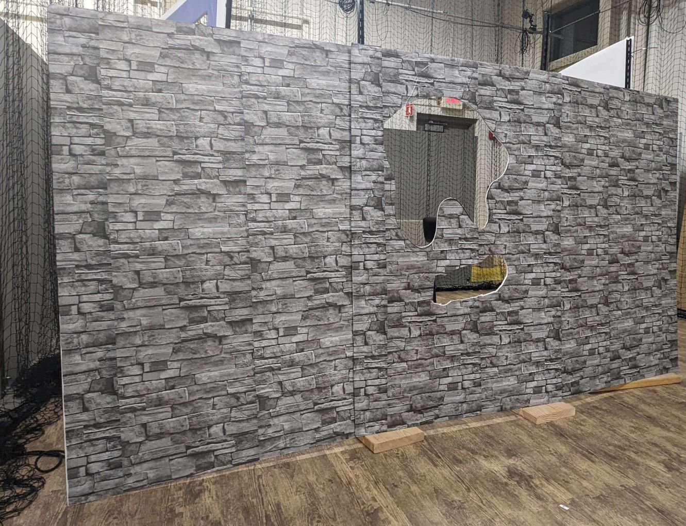
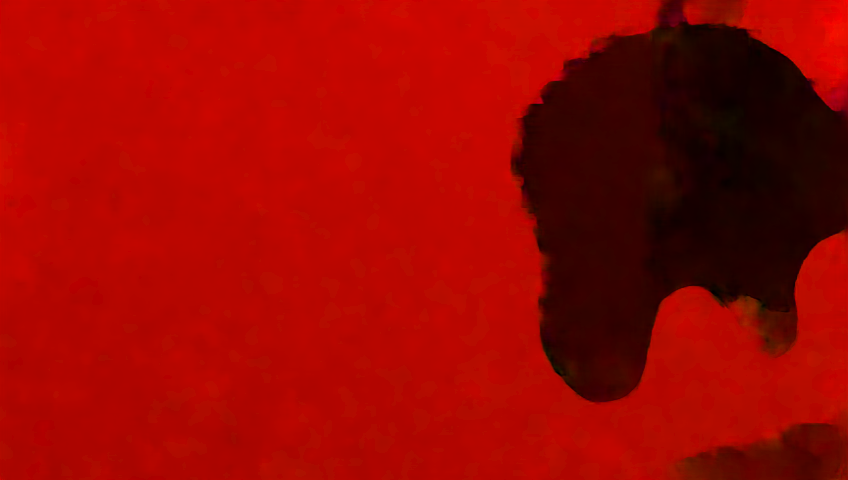
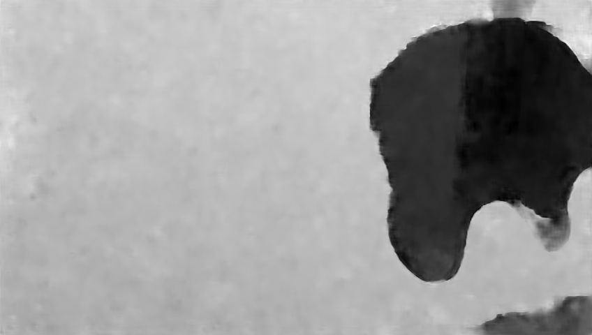
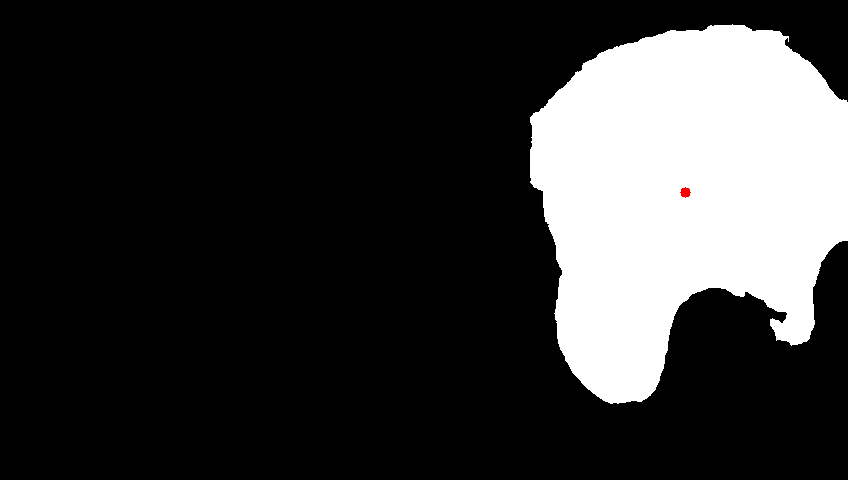

# Flight Through Unknown Gap - Drone Navigation Project

## Overview
This project showcases the perception and control stack we developed to enable a DJI Tello drone to autonomously navigate through gaps of unknown shape and size. This project demonstrates the potential for drones to operate in complex and previously unchartered environments, possibly finding use cases in safety critical missions.

## Key Features
- **Autonomous Gap Navigation:** Engineered to enable a DJI Tello drone to autonomously fly through various gaps without prior knowledge of their dimensions or shapes.
- **Advanced Perception Stack:** Utilized state-of-the-art technique for optical flow analysis to accurately identify navigable gaps in real-time.
- **Robust and Versatile:** Tested and achieved a 100% success rate in navigating gaps across a range of different environments, showcasing the adaptability and reliability of the system.

## Technologies Used
- **Drone Technology:** DJI Tello Drone
- **Optical Flow Analysis:** SPyNet (Spatial Pyramid Network for Optical Flow)
- **Programming Languages and Frameworks:** Python, PyTorch

*Real Gap*

*Colorized Optical Flow*

*Normalized magnitude of Optical Flow*

*Detected gap with its centre*

## Results
Our system has shown exceptional performance with a 100% success rate in navigating through gaps of various shapes and sizes in different environments. 

